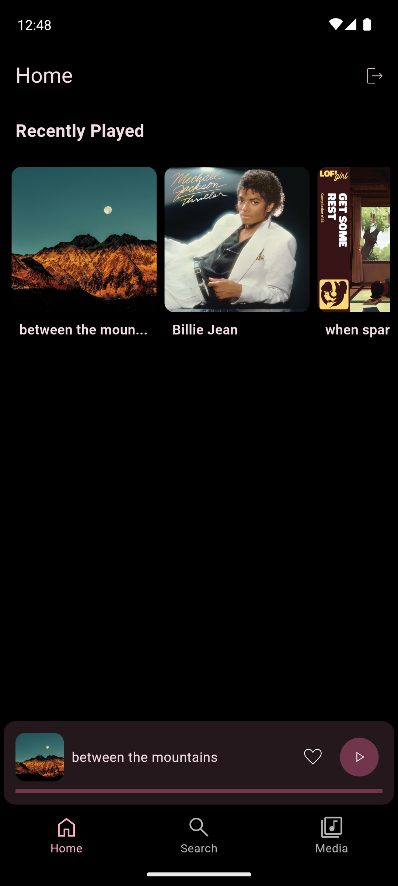
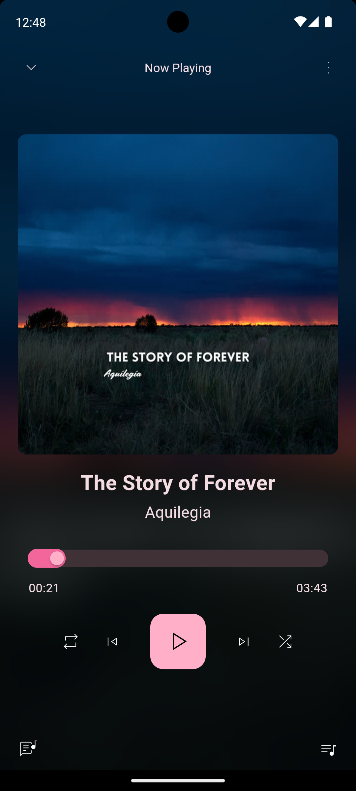
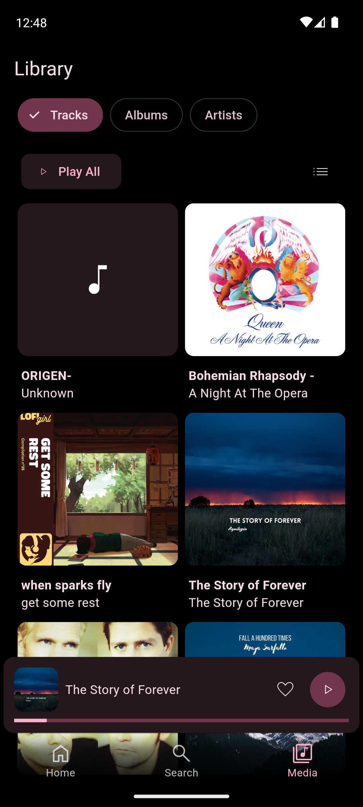

# Disifin - Jellyfin Music Client [WIP]

Disifin is a Flutter-based music client for Jellyfin, an open-source media server. This project aims to provide a seamless music streaming experience with features like track playback, album and artist views, and more.

|  |  |  |
|-----------------------------------|-----------------------------------|-----------------------------------|

## Features

- **Track Playback**: Play individual tracks with a fullscreen audio player.
  - **Album View**: Browse and play albums with a switchable list and grid view.
  - **Artist View**: Browse and play artists with a switchable list and grid view.
  - **Queue Management**: View and manage the current playback queue.
  - **Playback Controls**: Control playback with play, pause, skip, and seek functionalities.
  
## Getting Started

### Prerequisites

- [Flutter](https://flutter.dev/docs/get-started/install) (version 2.0 or higher)
- A running instance of [Jellyfin](https://jellyfin.org/)

### Installation

1. **Clone the repository:**
   ```sh
   git clone https://github.com/Nandanrmenon/disifin.git
   cd disifin
   ```

2. **Install dependencies:**
   ```sh
   flutter pub get
   ```

3. **Run the app:**
   ```sh
   flutter run
   ```

## Contributing

Contributions are welcome! Please open an issue or submit a pull request for any improvements or bug fixes.

## License

This project is licensed under the MIT License. See the [LICENSE](LICENSE) file for details.

## Acknowledgements

- [Jellyfin](https://jellyfin.org/)
- [Flutter](https://flutter.dev/)
